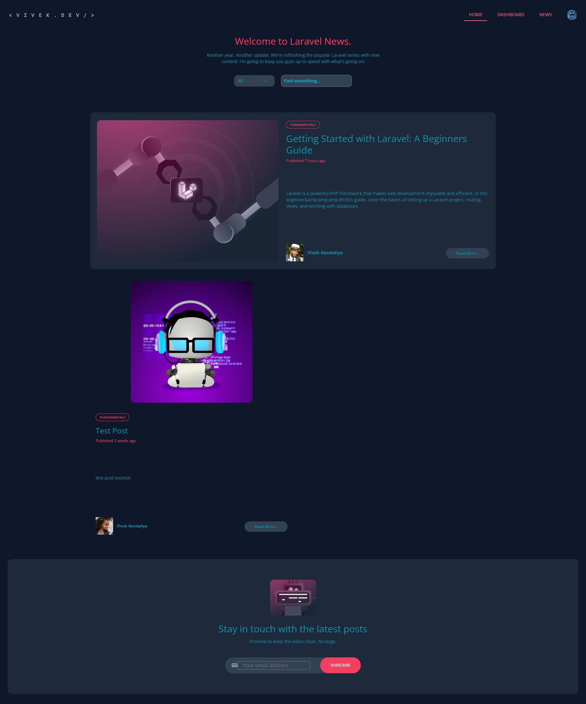
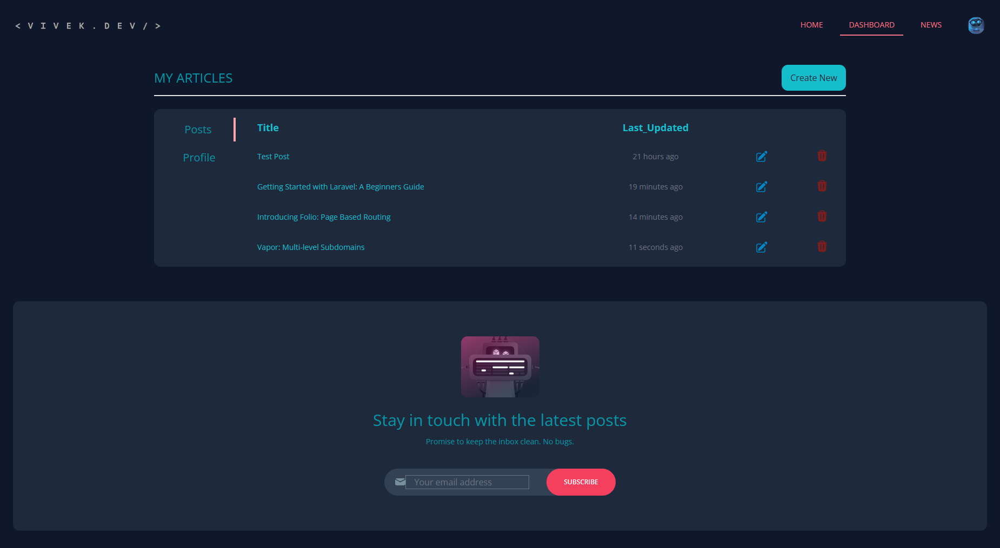
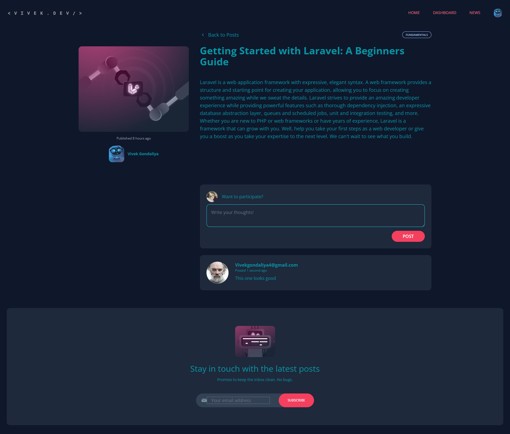
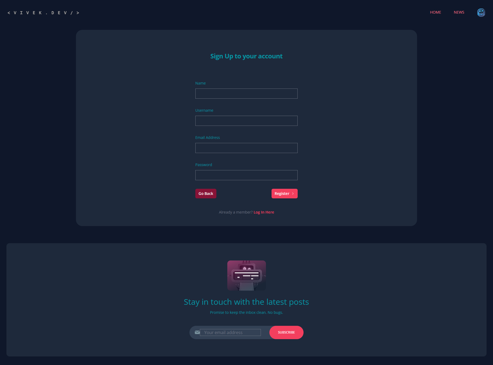

## About Project

A Simple laravel personal blog app with authnetication and autorization for system admins

In Backend

-   Framework: Laravel 10
-   Database: MySql
-   Subscription service: Mailchimp
-   Css Library: Tailwind

## How to use

1. Clone or Download project
2. Change db configuration in .env
3. Run migration and seed: php artisan migrate:fresh --seed
4. Run frontend: npm run dev
5. Run php dev server: php artisan serve

## Screen Shots

### Home Page

### Dashboard

## Post View

## Authentication

## Registration Page

